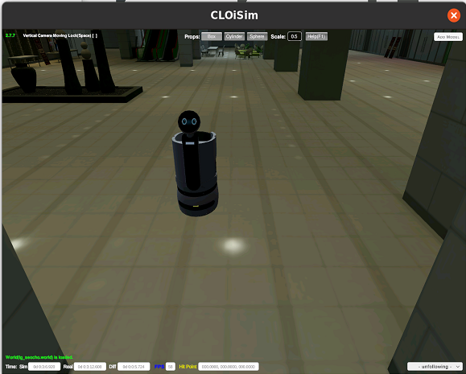
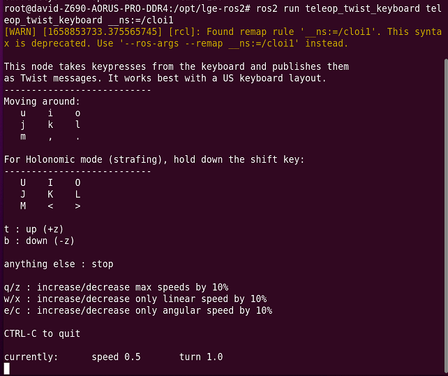
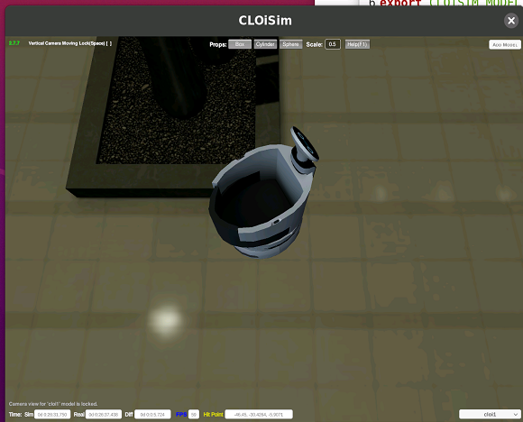
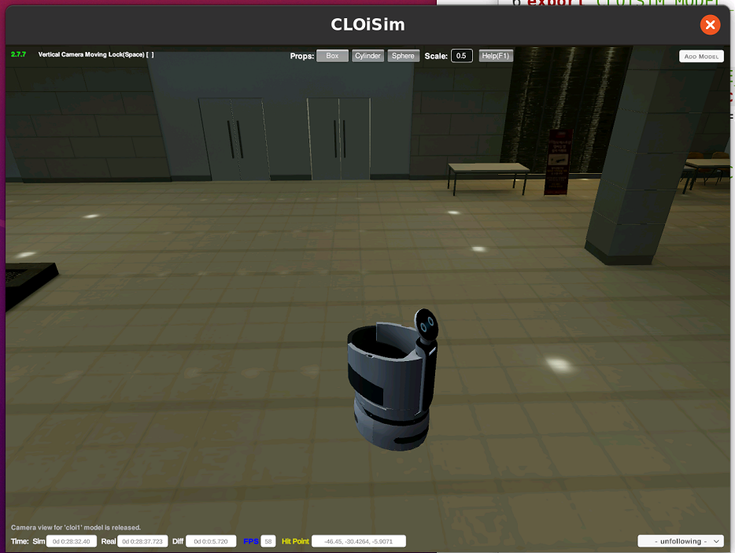

# 07/26 화
cloisim을 도커로 실행해 보자.

[LGE-ROS2 깃헙](https://github.com/lge-ros2)  
LG전자에서 ROS를 이용한 시뮬레이터를 개발했다. 레포지토리 몇 개가 공개되어 있고, 클로이심 프로그램도 배포되어 있다.  
이 중 [cloisim](https://github.com/lge-ros2/cloisim)과 [cloisim_ros](https://github.com/lge-ros2)를 이용해서 도커에서 클로이심을 실행해 보자.

## cloisim in docker
1. 리소스 다운  
[lge-ros2/sample_resources](https://github.com/lge-ros2/sample_resources)깃헙에서 배포 중이다. lg 서초 옥사에 자료와 클로이 로봇에 대한 모델 등이 있다. 이 레포를 클론하고 해당 디렉토리를 리소스 디렉토리로 export한다.
```sh
cd ~ # 혹은 원하는 디렉토리 아무곳
git clone https://github.com/lge-ros2/sample_resources.git
```


2. cloisim 도커 빌드  
[https://github.com/lge-ros2/cloisim](https://github.com/lge-ros2/cloisim)을 클론한 다음 도커 이미지를 빌드한다.  
도커 이미지 빌드는 깃헙에 친절히 정리되어 있다. 도커 컨테이너 생성과 실행도 모두 레포지토리에 포함되어 있다.
 `start.sh`을 이용하면된다.  
`start.sh`을 이용하기 위해서는 리소스 디렉토리를 연결해 주어야 한다.
```sh
export CLOISIM_RESOURCES_PATH=~/cloisim_resources # 리소스 레포를 클론한 경로로 입력!
export CLOISIM_FILES_PATH=$CLOISIM_RESOURCES_PATH/media
export CLOISIM_WORLD_PATH=$CLOISIM_RESOURCES_PATH/worlds
export CLOISIM_MODEL_PATH=$CLOISIM_RESOURCES_PATH/models
```  
그 다음 `./start.sh lg_seocho.world`를 실행하면 클로이가 있는 lg서초 옥사가 나온다.
**`start.sh`의 도커를 실행하는 명령줄에 `--name cloisim`을 추가해주자. 추가하지 않으면 컨테이너 이름이 랜덤하게 설정된다.**



3. cloisim_ros 도커 빌드
[https://github.com/lge-ros2](https://github.com/lge-ros2)를 클론한 다음 도커 이미지를 빌드한다. 이것도 잘 따라하기만 하면 된다.
아래 명령어를 실행해 준다.  
```sh
export CLOISIM_BRIDGE_IP=$(ip addr show dev docker0 | grep "inet" | awk 'NR==1{print $2}' | cut -d'/' -f 1)
export ROS_DOMAIN_ID=22
export CLOISIM_SERVICE_PORT=8080
```  
그 다음 `./launch.sh`을 해주면 되는데 **여기도 `--name cloisim_ros` 옵션을 추가해주자.**  

**cloisim_ros는 반드시 cloisim 도커 컨테이너가 실행 중일 때 시작해야 한다.**


3. 클로이 움직여보기  
[참고 포스트: ROS - 1. ROS2 설치 및 CLOi 시뮬레이터](https://rubenchoi.tistory.com/51)
실행 중인 도커 컨테이너에 새로운 터미널 연결하기
```sh
docker exec -it cloisim_ros /bin/bash
```
도커 컨테이너 내부에서 아래 명령어를 실행한다.
```sh
apt-get update
apt-get install ros-foxy-teleop-twist-keyboard # foxy가 아닌 다른 버전이면 해당 버전 이름을 쓴다.(아마도)
source /opt/ros/foxy/setup.bash
cd /opt/lge-ros2
. install/local_setup.bash

ros2 run teleop_twist_keyboard teleop_twist_keyboard __ns:=/cloi1
```  


터미널에 키 커맨드를 입력하면 클로이 로봇이 움직이면서 돌아다닌다.
  

