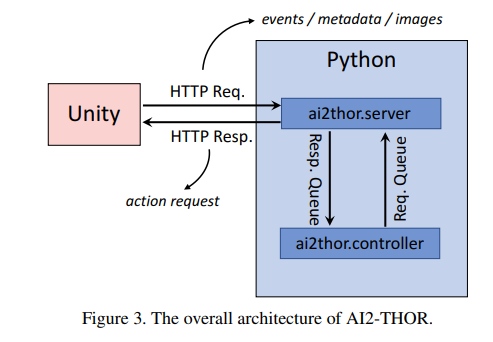
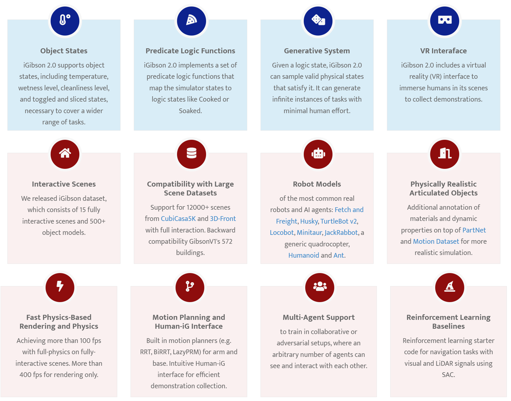

Review

A Survey of Embodied AI: From Simulators to Research Tasks
===========================================================
>Jiafei Duan, Samson Yu, Hui Li Tan, Hongyuan Zhu, Cheston Tan
-------------------------------------------------------------

# Abstract
"Internet AI" 시대에서 "Embodied AI" 시대로 패러다임의 변화 발생

* Internet AI: 이미지, 비디오, 텍스트로 학습(전문적으로 감별된 큰 데이터셋으로부터 학습)
* Embodied AI: 실제 시뮬레이션에서 학습(인간처럼 자기중심적 관점으로 환경과 상호작용)
9개의 Embodied AI Simulator는 7개의 1차 특징, 3개의 2차 특징으로 평가된다.

Embodied AI의 3대 과제 
* Visual Exploration, 
* Visual Navigation, 
* Embodied Question Answering(QA)

본 논문에서는 3가지 과제에 대한 최신 접근법과 평가 방법, 데이터셋에 대해 다루며 시뮬레이터 선택에 도움을 줄 것이다.

# Primary and Secondary Features of EAI Simulators (Table I)
* 7개의 primary features
    * Environment
        * **G**ame-based: 3D 자산으로 구성. 물리적 특징과 객체 분할이 잘 구현되어 움직임이 있는 모델링에 적합
        * **W**orld-based: 현실 세계의 스캔. 현실 세계 반영도가 높으며 Sim2Real에 유용. 많은 자원이 필요함

    * Physics
        * **B**asic features: 충돌, 강체 역학, 중력 모델링. 대부분 이 특징으로 구성(Basic으로 충분하기 때문)
        * **A**dvanced features: 천, 유체, 연체 물리학. 복잡한 물리 환경이 필요한 경우 사용

    * Object Type
        * **D**ataset-driven: 객체 수집이 어렵고 비용이 높지만 Quality가 보장됨 (기존 3D 객체 데이터셋)
        * (**O**bject) Asset-driven: 누구나 접근 가능하여 수집이 쉽지만 Quality가 보장되지 않음 (Asset Store 이용)

    * Object Property
        * **I**nteract-able: 충돌과 같은 물체 간의 상호작용만 가능
        * **M**ultiple-state: 물체가 어떻게 반응하고 상태를 변화시키는지까지 가능

    * Controller
        * Direct **P**ython API
        * Virtual **R**obot: ROS 인터페이스처럼 실세계의 로봇(터틀봇 등)과 상호작용이 가능하게 한다.
        * **V**irtual Reality: 더 몰입적인 HCI를 제공하여 실세계 물건들을 배치할 수 있다.

    * Action
        * **N**avigation: 가장 하위 레벨. Embodied AI Simulator의 특징으로, 가상 공간을 탐색하는 능력
        * **A**tomic Action: 인공 Agent가 객체에 대한 간단한 행동들을 수행. 많은 Simulator에서 지원
        * **H**uman-Computer Interaction: 사람이 가상 Agent가 학습하고 상호작용하는 것을 실시간으로 제어

    * Multi-Agent
        * **A**va**t**ar-based: 인공 Agent와 Simulation 아바타가 상호작용. (ex. ThreeDWorld)
        * **U**ser-based: 2개의 학습 네트워크 역할이 주어진 서로 다른 인공 Agent가 상호작용 (ex. AI2-THOR)
  

 
* 3개의 secondary features
    * _Realism_: Environment, Physics   
    환경은 현실 세계의 물리적 외관을 모델링하는데, 물리 (엔진)는 현실세계의 복잡한 물리적 성질을 모델링한다.
    * _Scalability_: Object type   
    실세계의 3D 스캔 데이터셋을 모으거나 3D 애셋을 사면서 확장할 수 있다.
    * _Interactivity_: Object property, Controller, Action, Multiple agents   
    __위 특징 세 가지를 모두 가진 시뮬레이터 (AI-THOR, iGibson, Habitat-Sim)은 다양한 embodied AI 연구작업에 활발히 사용된다.__  

# Table II 시뮬레이터 비교분석 (사용성에 관한 비교?)
* Environment Configurations: application기능에 따라 다르다.
* Simulation Engine: 아래 두 term에 영향끼침
* Technical Specification
* Rendering Performance

[참고자료 ppt에 이 설명을 추가](https://mindw96.tistory.com/5)

1. DeepMind Lab
1. AI2-THOR
1. CHALET
1. VirtualHome
1. VRKitchen: Object
1. Habitat-Sim 
1. iGibson
1. SAPIEN
1. ThreeDWorld: advanced Physical engine을 가진 희귀한 시뮬레이터

## 3개의 킹왕짱 시뮬레이터
* 공통점  
3가지 secondary features 모두 가짐
navigation, atomic action, ROS지원

1. AI2-THOR  [홈페이지](https://ai2thor.allenai.org/)
RoboTHOR을 제어하는 가상 로봇 컨트롤러 포함
 출처: [ai2-thor 논문](https://arxiv.org/pdf/1712.05474.pdf)
> AI2-THOR의 구성
> (1) 유니티 게임엔진에서 빌드된 장면셋
> (2) 게임엔진과 상호작용하는 가벼운 python api 
> 파이썬쪽에서는 유니티가 보낸 http 요청을 받는다. 게임엔진에서 액션을 취하면 화면이 JSON형식 메타데이터로 저장된다. 
> 유니티내에서 응답을 한 번 받으면 요청된 액션이 취해진다. 

1. iGibson [홈페이지](https://svl.stanford.edu/igibson/)
iGibson’s Castro를 제어하는 가상 로봇 컨트롤러 포함
그래픽 랜더링 성능 좋다.

> 오픈 소스 시뮬레이션 환경인 iGibson 2.0
> 온도, 습도 수준, 청결 수준, 토글 및 슬라이스 상태를 포함한 객체 상태를 지원
>  iGibson 2.0에는 가상현실(VR) 인터페이스가 포함 (인간의 데모를 수집하고 모방 학습에 사용가능)
> 출처: arXiv:2108.03272 (https://arxiv.org/abs/2108.03272)

1. Habitat-Sim [홈페이지](https://aihabitat.org/)
그래픽 랜더링 성능 좋다.
configurable agents, multiple sensors
> (1)ReplicaCAD: 아티스틱 오브젝트(예: 개폐가 가능한 캐비닛 및 서랍)가 있는 (실제 공간과 일치하는) 예술가가 작성한 3D 데이터 세트가 있다.
> (2) 8개의 GPU 노드 상에서 25000 시뮬레이션 스텝을 수행한다. 물리적 효과를 지원하는 3D 시뮬레이터이다.
> (3) Home Assistant Benchmark(HAB): 다양한 모바일 조작 기능을 테스트하는 보조 로봇(집 정리, 식료품 준비, 테이블 세트)의 공통 작업을 포함했다.
> 출처: arXiv:2106.14405 (https://arxiv.org/abs/2106.14405)

# 과제 조사, Table III, Fig 6
각 과제와 연관된 시뮬레이터, 데이터셋 정리
## VE
> 에이전트는 환경을 돌아다니며 지도를 그린다. (에이전트가 지도를 빨리 그리도록 장려하기 위해) 예산(돌아다닐 수 있는 step 수)을 제한한다.

|전통적인 로보틱스|학습 기반 접근법|
|-----------------|----------------|
|SLAM 센서 이용|RGB/D 센서 이용|
|노이즈 취약|노이즈 내성|
|파인튜닝 많이 필요|비교적 적음|
 
인공 에이전트가 지도의 의미적인 내용을 이해하고 얻은 지식을 일반화함으로써 **사람의 노동력을 절약**한다.

내부 모델 종류
* Topological graph map
* Sementic map
* Occupancy map
* Spatial memory

### Approaches

0. 일반적으로 non-baseline 접근법은 전형적으로 observed Markov 결정 프로세스(POMDPs)로 정형화된다. 이런 접근법은 POMDPs 보상 펑션으로 볼 수 있다.

1. Baseline
* random-action: 균일하게 분포된 확률에 따라 액션을 정한다.
* forward-action: 앞으로 가는 액션을 선택한다. forward-action+에서는 에이전트는 앞으로 가다가 부딪히면 왼쪽으로 돈다.
* frontier-exploration: 지도를 사용하여 자유공간(개척 공간)과 미개척 공간 사이 경계선(?)을 반복적으로 방문한다.

2. Curiosity
Agent는 예측하기 어려운 상태를 갖는다.  
강화 학습의 보상 신호: 예측 오차  
외부 보상이 희박한 경우에 유익하다.  
환경으로부터의 외부 보상보다는 내재적 보상과 동기 부여에 초점을 맞춘다.

* forward-dynamics model  
Loss: L(s'\_(t+1), s\_(t+1))을 최소화함.  
s'\_(t+1): 에이전트가 상태 s\_t에서 액션 a\_t를 취했을 때 예상된 다음 상태  
s_(t+1): 실제 다음 상태  
Proximal Policy Optimization(PPO)를 고려해서 모델을 적용해야 함
Sementic map을 그리는데 도움이 된다.  
높은 예측 에러(= 큰 보상)의 확률성을 사용하므로 문제이다. ([noisy-TV 문제](https://www.theverge.com/2018/11/1/18051196/ai-artificial-intelligence-curiosity-openai-montezumas-revenge-noisy-tv-problem)나 에이전트의 액션에 따르는 노이즈)  

* inverse-dynamics model  
이전상태 s\_(t-1)에서 현재 상태 s\_(t)로 오기 위한 에이전트가 취한 행동 a\_(t-1)을 추정  
에이전트는 어떤 행위로 환경을 통제할 수 있는지 이해  
이런 방식은 환경때문에 확률성을 다루려고 하는데 에이전트의 행위에 의해 결과가 발생하는 확률성을 다루는 것은 불충분하다.

> forward/inverse-dynamics model의 문제  
> 예측 에러가 곧 보상이 된다. 예측 에러는 확률성을 사용한다. 
> 에이전트의 행위 -> 확률적으로 결과가 결정됨?
> * noisy-TV: AI도 기계처럼 랜덤한 보상에 끌린다. 

더 어려운 문제들을 해결하기 위해 최근에 제시된 방법들이 있다.
* Random Distillation Network [82]  
해결책은 호기심을 계산하지만 환경의 확률적 요소에 이끌리지 않는 방법  
랜덤하게 초기화된 신경망의 출력을 예측하는 것인데, 신경망은 입력에 대해 deterministic한 함수이다. (확률을 가지고 랜덤한 함수가 아님)  

* Exploration by Disagreement [81]  
에이전트가  `forward-dynamics models` 앙상블의 예측들 사이에 최대 불일치 혹은 분산을 갖는 행동공간을 탐색하도록 장려되는 불일치에 의한 탐색이다.
모델은 평균에 수렴하게 되는데, 모델은 조합(ensemble)의 분산을 줄이고, 확률성 트랩에 갇혀버리는 것을 예방한다. 

3. Coverage
Agent가 직접적으로 관찰하는 Target의 수를 최대화하도록 노력. 자기중심적 관찰을 하므로 3D 장애물에 기반하여 탐색해야 함

* 고전적 방법 + 학습 기반 방법 :  
학습된 SLAM 모듈로 경로 플래너를 분석.  
end-to-end 정책에 수반된 높은 샘플 복잡성을 피하기 위해 공간 지도를 유지.  
실세계에서 로봇을 일반화할 수 있도록 물리적 현실성을 개선하기 위해 노이즈 모델을 포함.

* Scene memory transformer:  
자기 중심 매커니즘. 모든 관찰결과를 저장. 귀납 성향이 필요한 지도같은 메모리에 비해 더 유연하고 확장성이 좋음.

4. Reconstruction

* 과거:  
360도 파노라마, CAD 모델의 픽셀별 복원에 집중 → 사람이 찍은 사진 데이터셋이 엄선됨 (최근에는 픽셀별 복원보다 의미별 복원에 더 집중. 의미적 개념이 샘플된 쿼리 지역에 존재하는지 예측하도록 설계함)
* 현재:  
Agent의 자기중심적 RGB-D 관찰, 가시 영역을 벗어난 점유 상태 재구성. 정확한 사용 지도로부터 시간에 따른 예측을 집계하여 정확한 점유 지도 형성 → Agent의 자기중심적 관찰과 센서의 컨트롤로부터 장면 복원을 수행하므로 더 복잡

>Coverage 접근법과 비교: 점유(사용) 상태를 예측하는 것은 Agent가 직접 관찰하지 않는 지역을 다룰 수 있게 함  

* K-Means 접근법: 
쿼리 위치에 대한 진짜 복원의 개념은 특징 표현에 가장 가까운 J개 군집 중심이다. 
Agent는 샘플된 쿼리 시야에서 예측하여 진짜 복원하여 뷰를 얻으면 보상을 받는다.

### Evaluation Metric

* Amount of targets visited(타겟이 방문한 횟수)   
영역(area), 흥미로운 물건과 같은 다른 타겟의 종류도 고려된다.
`area visited metric`은 다양한 방식이 있다. m^2단위의 절대범위, 장면상에서 탐사된 영역의 비율(%)

* Impact on downstream tasks(다음 작업에 끼친 영향)  
VE의 성능은 VN과 같은 다음 작업에의 영향으로 측정될 수 있다.)
이런 메트릭은 최근 연구에서 많이 보인다.

VE의 출력을 사용하는 다음 작업 예시
    * Image Navigation [26], [73]
    * Point Navaigation [11], [44]
    * Object Navigation [53], [54], [56]  

### Datasets
인기있는 데이터셋: 
* photorealitic RGB 데이터셋: Matteport3D, Gibson V1  
깊이, sementic segmentation과 같은 eAI에 필요한 유용한 정보를 포함.

Habitat Sim에서는 위 데이터셋을 쓰는데 다른 에이전트를 설정하고 많은 센서를 사용하는 추가 기능이 있다.
Gibson V1은 상호작용이나 실제 로봇 iGibson제어와 같은 특징들을 덧붙일 수 있다.
섹션 II에서 말했다시피 최근에 나온 시뮬레이터는 모두 시각적 탐사에 사용될 수 있다.
  
## VN 
외부로부터 사전 명령을 받거나 자연어 명령을 받을 수도 있다.
Point / Object Navigation이 가장 흔하다. (이미지, 영역 등의 타겟 존재)
지각적 입력과 언어 설명서를 통해 
사전 탐색, 비전-언어-탐사 그리고 EQA처럼 더 복잡한 VN 작업을 수행할 수 있다.

### approaches
* classic navigation approaches  
보통 국소화, 매핑, 경로 계획, 운동같은 수작업 하위 요소들로 구성되어 있다.
VN은 사례별 수작업을 줄이기 위해 이런 탐사 시스템을 데이터로부터 학습하기를 목표로 삼는다. 그래서 qa같은 데이터에 따라 처리하는 학습 방법으로 다음 작업이 더 좋은 성능을 내도록 쉽게 통합하려 한다.

* learning-based approaches
RGB and/or 깊이 센서를 사용하므로 센서 노이즈 측정에 더 강하다. 환경에 대한 의미적 이해를 통합할 수 있다. 에이전트가 이전에 본환경에 대한 지식을 일반화할 수 있게 하고 새로운 환경을 비지도 방식으로 이해하는 것을 돕는다. 인력이 덜 든다.

* hybrid approach  
classic의 장점과 learning-based의 장점 통합

1. Point Nav
2. Object Nav

3. Navigation with Priors  
의미적 지식을 주입하거나 다양한 입력형태를 사전에 받는 것에 집중한다. 지식그래프나 오디오 입력이나 아무 환경에서 EAI 에이전트가 네비게이션 작업훈련을 돕는것 같은 일이다.

딥 강화학습 프레임워크에서 통합된 사람의 사전지식을 사용하는 과거의 성과는 인공 에이전트가 사람같은 의미적/기능적 사전지식을  이용해서 에이전트가 (미지의 환경에서 본 적 없는 객체를 찾아가고 찾아내기위한 ) 학습하는 데에  도움이 된다는 것을 보여준다.  
사람이 물건을 찾기 위해서 논리적 위치(ex. 과일은 냉장고에 있다)를 보는 경향이 있는데 이러한 지식은 그래프네트워크에 인코딩되고 딥 강화학습프레임워크에서 훈련된다.

인간은 인식과 소리나는 물체의 물리적 위치를 대응시키는 능력이 있다. 소리나는 물체를 찾기 위해서는 비전과 소리신호를 모두 감지해야 한다. 비전 인식 매핑기와 소리 인식 모듈과 dynamic 경로 플래너가 모두 잘 동작해야 한다.

4. Vision-and-Language Navigation(VLN)  
에이전트가 자연어 명령어를 따라서 환경을 탐사하는 것을 배운다.  

* challenging point
    * 시각 장면정보와 언어를 연속적으로 받아내야 함
    * 에이전트가 과거 액션과 명령어에 기반해서 미래의 액션을 예측해야 함

자연어 명령어로 그들이 매끈하게 움직이기 힘들 수도 있다.
 
|      | 비전-언어 탐사 | Visual QA |
|------|----------------|-----------|
|공통점|시각기반, 순서에 따라 트랜스코딩|
|차이점|더 작업이 오래걸림. 비전데이터 입력이 끊임없이 제공되어야 하고, 카메라 시점을 변경하는 기능도 필요하다.| 하나의 입력 질문을 받아서 답을 생성한다.|

로봇에게 자연어로 명령을 내리고 작업[2,3,58]을 하도록 기대할 수 있다.
* 사용된 기법  
    * 진보된 recurrent 신경망 기법으로 시각, 자연어를 공동해석함  
    * 3D환경에서 탐사하고 작업을 작업기반 명령어 프로세스로 간단화 하게 디자인된 데이터셋

* Auxiliary Reasoning Navigation framework (보조 추론 탐사) 를 이용한 VLN 접근법  
    보조 추론탐사의 4가지 과제
    * trajectory retelling
    * process estimation
    * angle prediction
    * cross-modal maching

    에이전트는 과거의 액션을 추론하고 미래의 정보를 예측한다.

* Vision-dialog navigation (VLN의 확장판)  
    에이전트가 길찾기에 도움이 될 수 있는 사람과 일정한 자연어 대화를 하는 능력을 기르도록 학습한다.  
    최근 연구[60]에서는 Cross-Modal Memory Network(CMN)을 사용한다. 이것은 별도의 언어 메모리와 시각 메모리 모듈을 통해서 이전 네비게이션 액션과 관련된유용한 정보를 기억하고 이해한다. 나아가 탐사를 위한 결정을 내린다.

### Evaluation metric
* VN
1. (정규화된 역) 경로 길이로 가중화된 성공(SPL): 수식 있음
2. 성공률: 제한 예산 안에 에이전트가 목표에 도달한 에피소드 비율
3. 예측된 경로와 성공한 에피소드에서 계산된 최단경로 길이의 비율
4. 성공/길찾기 오차 길이 (에이전트의 최종 위치와 가까운 객체나 목표 위치주변 성공 스레시홀드 경계사이의 거리)

* VLN
1. oracle success rate  
에이전트가 궤도 상에서 목표와 가장 가까운 지점들에 멈추는 비율.
2. trajectory length 궤도 길이  
VLN에서는 SPL이 제일 좋은 메트릭이다.목표뿐만아니라 사용된 경로를 고려한다.

* Vision-dialog navigtion
성공률이랑 오라클 성공률도 하지만 다른 메트릭도 있다.
1. goal progress  
에이전트가 목표를 향한 평균 진행?
2. oracle path success rate  
최단 경로를 따라 목표와 가장 가까운 지점에서 에이전트가 멈추는 성공 비율

### Dataset
* VN  
VE와 유사한 데이터셋 사용.  
Matterport3D와 Gibson V1이 가장 인기있다. Gibson V1이 더 작고, 짧은 에피소드(시작지점에서 목표지점까지 GDSP가 낮다)들이 있다.
AI2-THOR 시뮬레이터/데이터셋도 쓰인다.

* VLN  
좀 다른 유형의 데이터셋 필요.  
Matterport3D 시뮬레이터에 딸린 Room-to-Room(R2R)데이터셋 (평균 29단어로 이루어진 21567 개의 길찾기 명령어)

* vision-dialog navigation  
Cooperative Vision-and-Dialog Navagation (CVDN) 데이터셋  
2050개의 사람끼리 대화와 Matterport3D 시뮬레이터 상에서의 7000개의 궤적

## EQA

eQA는 요즘에 범용 지능으로 성장하고 있다.
QA는 물리적 구체화 상태에서 QA를 수행하는 것은 많은 AI 능력을 필요로 한다. (너무 힘든 작업...)

> QA에 필요한 AI 기능
> * 시각 인식
> * 언어 이해
> * 질의응답
> * 상식 추론
> * 태스크 플래닝
> * goal-driven navigation
 

### 1) Categories
eQA는 navigation task와 qa task로 나뉜다.

* PACMAN[61]  
네비게이션 모듈에 구조 계층을 구성하는 기능
플래너에서 행위와 방향을 결정하고, 컨트롤러가 각 행위에 따라 얼마나 멀리 움직일지 결정함

Navigation 모듈과 QA 모듈은 따로 개발되고 `REINFORCE`로 합친다.
[62], [63]은 더 고성능 마스터 정책은 의미적 하위 목표가 하위정책으로 실행되게 하는 신경 모듈식 제어(NMC)로 팩맨 모델을 더 개선했다.

* Multi-target embodied QA(MT-EQA)  
더 복잡한 eQA작업으로, 여러 타겟을 가지는 질문을 연구한다. ("`침실`의 `사과`는 `거실`의 `오렌지`보다 `더 크니`?", 위치찾기, 물건 찾기, 비교하기)

* Interactive Questin Answering  
AI2-THOR환경에서 구현된 QA작업을 다루는 또 다른 작업이다.  
IQA는 EQA의 확장판. 
객체와 상호작용하는 에이전트가 특정 질문에 답하기 위해서 꼭 필요하다. ("`냉장고`에 `달걀`이 있니? 라는 질문에 답하기 위해서는 냉장고를 열어야 한다.)

[64]는 계층적 상호작용 메모리 연결망 (HIMN)을 제안한다. 
각 하위작업의 복잡성을 줄이는 동시에 이것은 다양한 시간 스케일?을 통틀어서 시스템 동작, 학습과 추론을 도와주는 제어부의 계층이다.  

> * 자기중심적 공간 게이트 반복 유닛(GRU):  
    환경의 공간 의미적 정보를 얻기위한 메모리 유닛으로서 반응한다.

> * 플래너 모듈은 다른 모듈에 대한 제어권을 가질 것이다. 모듈 목록: 
>     * navigator  
>     목표로 가는 최단경로를 찾기 위해 A* 탐색을 돌린다.
>     * scanner  
>     새 이미지를 찾기 위해 회전을 수행한다.
>     * manipulator  
>     환경의 상태를 변화시키기 위해 행동을 취한다.
>     * answerer  
>     AI 에이전트에게 보낸 질문을 답변한다.

> * [65]: Multi-agent embodied question answering in interactive environments,
> [65]는 다중 에이전트 관점에서 IQA를 연구했는데, 일부 에이전트는 질문에 답하기 위해 협력해서 상호작용하는 장면을 탐색했다.
> [65]는 여러 에이전트와 공유되어 3D장면을 먼저 재구성하고 QA를 수행할 수 있도록 다층 구조로 되어있고 장면 메모리로써의 의미적 메모리를 제안했다. 

### 2) Evaluation Metrics
EQA와 IQA는 두 하위 작업을 포함한다.
* Navigation
* Question Answering

Navigation 성능 평가 방법
1. 네비게이션 끝단에서 타겟까지의 거리 (=navigation error)
2. 시작점부터 마침점까지 움직일 때? 타겟까지의 거리 변화 (=gall process)
3. 에피소드 임의지점에서 타겟까지의 최단거리
4. 최대 에피소드 길이에 도달하기 전에 답변하려고 에이전트가 navigation을 종료하는 에피소드의 비율(%) (? 환경 탐색할 때 제한된 step을 초과하지 않고 질문에 대한 정보를 모두 찾아서 탐색을 종료하는 비율 )
5. 에이전트가 타겟 객체가 있는 방 (탐색을?) 종료하는 질문의 비율(%)
6. 에이전트가 타겟 객체가 있는방에 한 번이라도 방문하는 질문의 비율(%)
7. 타겟 객체 집합의 교집합? 타겟 객체에 대한 합집합의 교차점? Intersection over Union for target obejct (IoU)
8. IoU 기반 정답률
9. 에피소드 길이 (=trajectory length)

1, 2, 9번은 VN 작업의 평가기준으로도 쓰인다.

### 3) Datsets
* EQA데이터셋은 House3D(SUNCG[33]데이터셋의 일부)기반이다.   
(Replica 데이터셋[107]과 비사한 방과 레이아웃을 종합한 SUNCG)  
House3D는 SUNCG 정적인 환경을 가상환경으로 변환하는데, 에이전트는 물리적 제약(벽을 뚫고 지나가지 못함)을 가지고 탐사(NAVIGATE)한다. 
에이전트의 language grounding(자연어-기계어 매핑?), 상식 추론과 탐사 능력을 테스트하기 위해서 [61]은 CLEVER의 일련의 프로그램 기능을 사용한다. CLEVER는 객체와 객체의 특성(색, 존재, 위치, relative preposition?)에 관한 질문과 답변을 합성한다.
750개의 환경에서 5000개의 질문이 있고 7개의 방 종류와 45가지의 객체가 있다.

* MT-EQA[63]  
객체의 특성 (색, 크기, 거리)을 비교하는 6가지의 구성 질문이 있다.

* IQA [64]  
저자가 75000개의 객관식 질문으로 구성된 대규모 데이터셋인 IQUAD V1에 주석을 달았다. EQA 데이터셋과 유사하게, IQUAD V1은 객체 존재, 개수 세기 및 공간 관계에 대한 질문이었다.

# IV. Insight and Challenges
시뮬레이터 - 데이터셋 - 연구과제간의 상관관계를 확립하고, 현재 embodied AI 분야의 도저과제를 다룬다.

# Conclusion
embodied AI 시뮬레이터와 연구의 트렌드와 차이를 알아보았다.
9개의 시뮬레이터를 7가지의 특성으로 평가했다.
시뮬레이터의 현실성, 확장성, 상호작용성의 여부를 확인했다.

3대 과제 VE, VN, EQA는 피라미드를 이루며 과제 접근볍, 평가방식, 데이터셋을 살펴보았다.
이 논문은 eAI 연구 카테고리를 다루며 현존하는 접근법들 리뷰했다.
시뮬레이터-데이터셋-연구 과제의 관계를 밝혓다.

